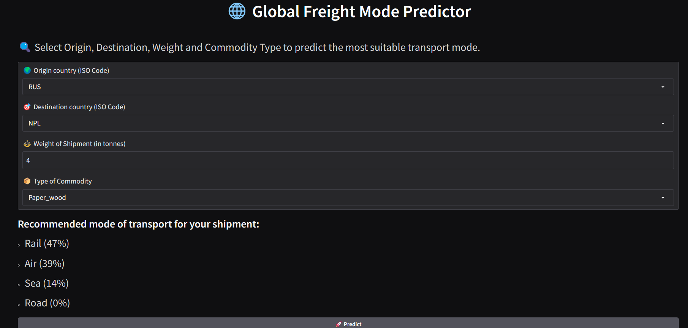

# 🌐 Global Freight Mode Predictor

Predict the most likely transport mode for your international shipment based on origin, destination, shipment size and commodity type. This Gradio‑powered web app uses a pre‑trained Machine Learning model and simple look‑ups to give you probabilities for Air, Sea, Rail, Road (and “new” modes) in a few clicks.

---

## 🚀 Live Demo

Hosted for free on Hugging Face Spaces:

> 👉 https://huggingface.co/spaces/your-username/global-freight-mode-predictor

---

## ⚙️ Features

- **Origin & Destination**: Choose from 200+ ISO‑3 country codes  
- **Flow**: Input shipment size in tonnes  
- **HS Category**: Select 1 of 19 commodity groups  
- **“New MoT” Tagging**: Captures model’s suggestion of modes never used by your origin  
- **Clean UI**: Built with Gradio Blocks + custom CSS  
- **Free Deployment**: Easily host on Hugging Face Spaces

---

## 📂 Repository Structure

